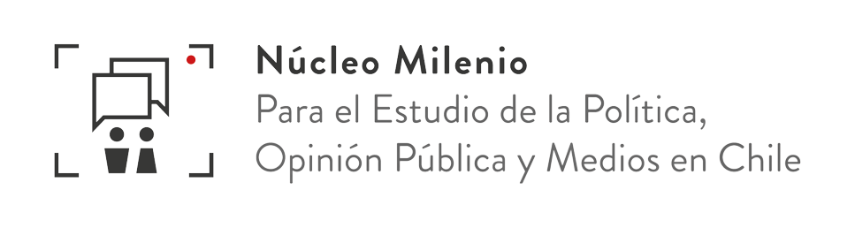
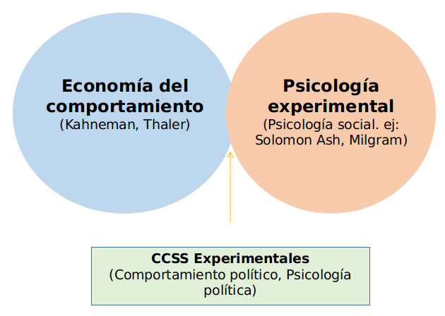
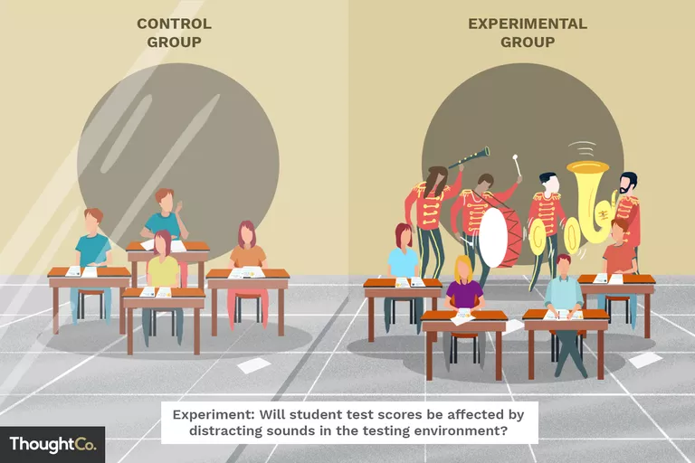
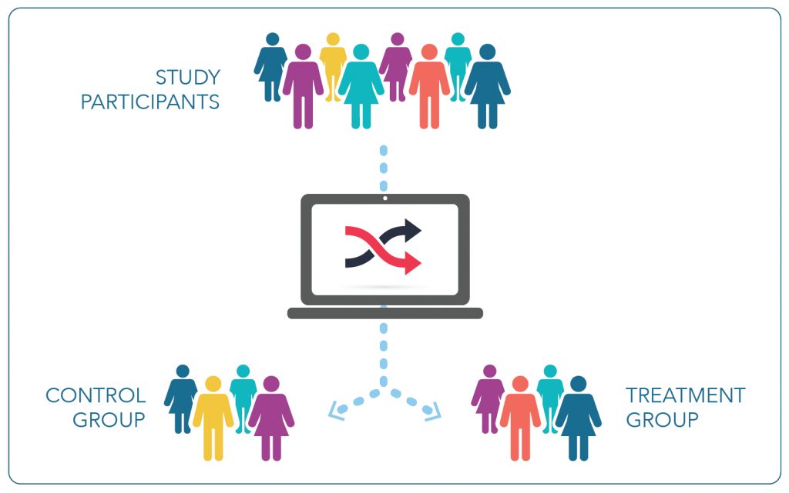
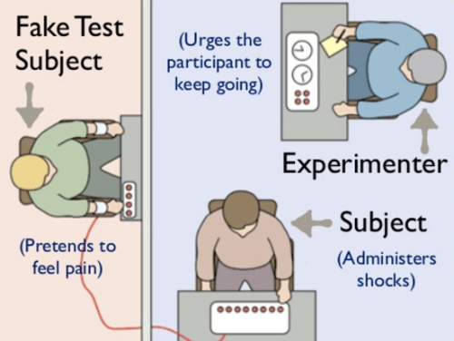
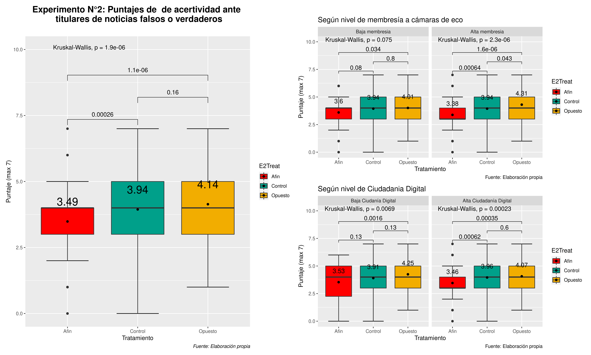
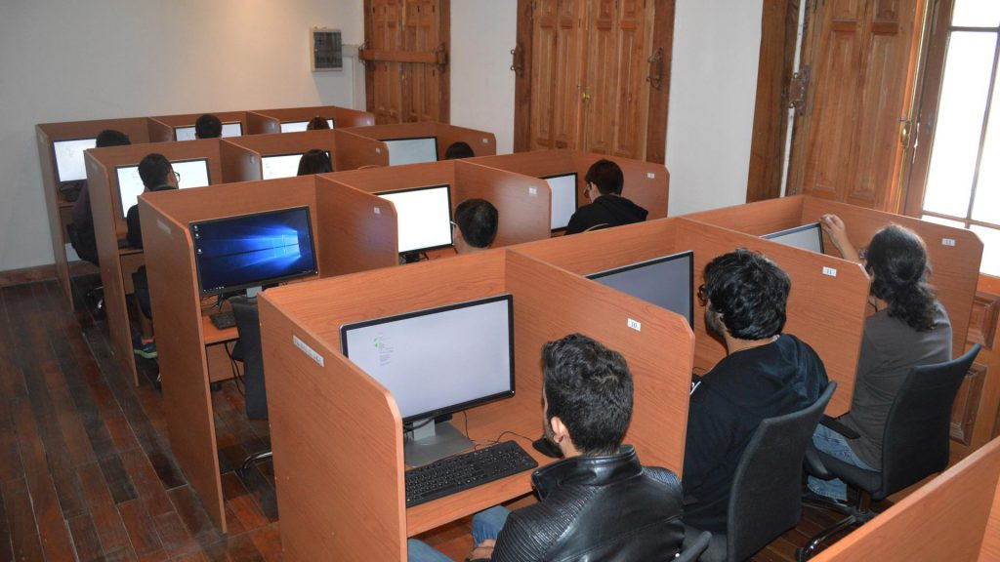
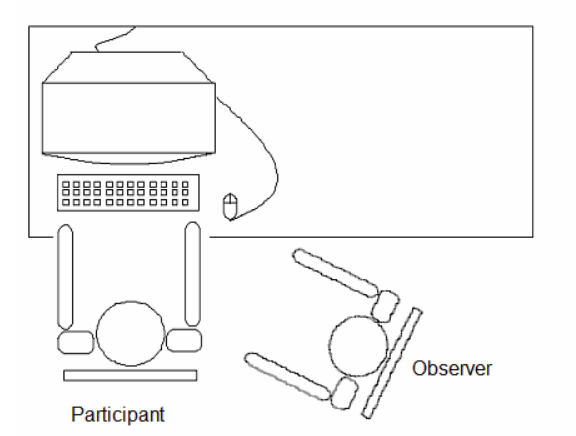
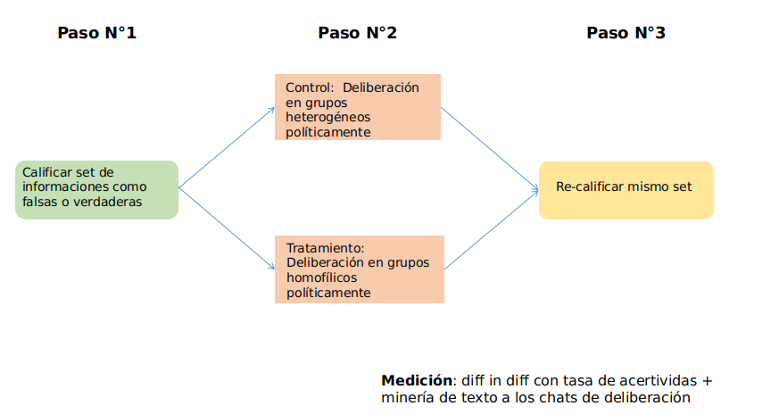

class:center, middle, bg_karl

```{r setup, include=FALSE}
options(htmltools.dir.version = FALSE)
knitr::opts_chunk$set(
  fig.width=9, fig.height=3.5, fig.retina=3,
  out.width = "100%",
  cache = FALSE,
  echo = TRUE,
  message = FALSE, 
  warning = FALSE,
  hiline = TRUE
)
```


```{r xaringan-themer, include=FALSE, warning=FALSE}
library(knitr)
library(xaringanthemer)
style_duo_accent(
  primary_color = "#b01333",
  secondary_color = "#085e9f",
  inverse_header_color = "#FFFFFF"
)
```
```{css, echo=F}
h1, h2, h3 {
  text-align: center;
}
```


```{css, echo = F}

.reduced_opacity {
  opacity: 0.1;
}


.bg_karl {
  position: relative;
  z-index: 1;
}
.bg_karl::before {    
      content: "";
      background-image: url('https://www.washingtonpost.com/wp-apps/imrs.php?src=https://arc-anglerfish-washpost-prod-washpost.s3.amazonaws.com/public/R6XIM6HGFZDSJJT5GHTYLYHIFI.jpg&w=1450');
      background-size: cover;
      position: absolute;
      top: 0px;
      right: 0px;
      bottom: 0px;
      left: 0px;
      opacity: 0.35;
      z-index: -1;
}
```

## Introducción a las Ciencias Sociales Experimentales

### Teoría, clasificaciones y estudios de caso

<br>

#### Francisco Villarroel Riquelme (CICS- UDD) 
#### 


<br>
<br>
<br>
<br>
<br>
```{r, echo=FALSE, message = FALSE, out.width="40%", fig.align='center', fig}

```

---
background-image: url(Untitled/Untitled_files/logo_mepop.png)
background-size: 200px
background-position: 97% 97%

# ¿Qué veremos hoy?

- La definición y los componentes de un experimento
- Comprender las líneas teóricas que lo sustentan y su potencial explicativo
- Mostrar los tipos de experimentos, junto a su potencial y debilidades

---
background-image: url(Untitled/Untitled_files/logo_mepop.png)
background-size: 200px
background-position: 97% 97%

.pull-left[

### El problema de la causalidad en las Ciencias Sociales

<br>
<br>
<br>

<center>¿Podemos separar causas y efectos?</center>


]


.pull-right[

```{r, echo=FALSE, fig.align='center', out.width="110%"}

knitr::include_graphics("session_1_files/meme.png")

```

]

---
background-image: url(Untitled/Untitled_files/logo_mepop.png)
background-size: 200px
background-position: 97% 97%

<center> <h2> Bases de los estudios de comportamiento (años 50's - 70's)</h2> </center>


```{r, echo=FALSE, fig.align='center', out.width="60%"}



```


---
background-image: url(Actitudes_files/Logo-Psicología-UDD.jpg)
background-size: 200px
background-position: 97% 97%
class: center, middle

## ¿Qué es un experimento?


---
background-image: url(Actitudes_files/Logo-Psicología-UDD.jpg)
background-size: 200px
background-position: 97% 97%
class: center, middle

## ¿Qué es un experimento?

--


>_"Un experimento es un testeo científico de hipótesis o o principios llevados a cabo bajo condiciones cuidadosamentre controladas de manera de determinar o descubrir algo desconocido. Los experimentos proveen insights sobre la relación entre cosas cuando los cambios en un elemento causan un efecto en otro"_ (Coleman, 2014)
---

class: inverse center middle

## Componentes fundamentales en un experimento

---
background-image: url(session_1_files/logo_mepop.png)
background-size: 200px
background-position: 97% 97%
class: left, middle

## Condiciones experimentales

.pull-left[

```{r, echo=FALSE, out.width="150%"}



```

]


.pull-right[

- Son una forma de intervención y modificación del entorno

- Compuesta de al menos dos: un tratamiento y un grupo control

- Teoría e hipótesis deben guiar la construcción de condiciones experimentales

- Debe haber una diferencia sustancial entre condiciones experimentales

- Pueden hacerse diseños sin tratamiento control, pero con línea de base

]
---
background-image: url(session_1_files/logo_mepop.png)
background-size: 200px
background-position: 97% 97%
class: left, middle

## Aleatorización

.pull-left[


- Asignación aleatoria de sujetos a cada condición experimental

- Permite diluir atributos personales para hacer un análisis causal más limpio (Tratamiento genera un efecto)

- Si bien la aleatorización simple es la más usada, existen otras técnicas como la aleatorización en bloque

]


.pull-right[

```{r, echo=FALSE, out.width="150%"}



```

]
---
background-image: url(session_1_files/logo_mepop.png)
background-size: 200px
background-position: 97% 97%

## ¿Este es un experimento propiamente tal?

--

.pull-left[

- El experimento de Milgram (1963)

- Mide el nivel de obediencia a la autoridad, hasta el punto de causar daños a otras personas

- Usos del engaño varían según disciplina. Actualmente este experimento es irreplicable

]

.pull-right[


```{r, echo=FALSE, out.width="150%"}



```

]
---
background-image: url(session_1_files/logo_mepop.png)
background-size: 200px
background-position: 1% 98%
class: left, middle

### ¿Cómo analizar los datos experimentales?


- De manera más común, se miden a partir de las diferencias entre medias, en particular con el _Averange treatment effect_ (ATE)

 

- Sin embargo, también se puede analizar a partir de métodos como

  - ANOVA'S
  - MANCOVAS
  - Test T
  - Regresiones OLS
  - Regresiones de máxima verosimilitud (Logit, Probit, etc)
  - Diff in Diff 
  
- Además, existen otros métodos de medición especiales para distintos experimentos (ej: CATE para experimentos de campo)

---
background-image: url(session_1_files/logo_mepop.png)
background-size: 200px
background-position: 1% 98%
class: left, middle


## Cuestiones éticas en la investigación experimental

- **Todos los estudios deben ser compensados monetariamente**

--

(Sin embargo, no todos se compensan de la misma forma)

--

- El uso de la mentira varía: En psicología social se usa mucho; en economía del comportamiento no se usa

--

- En estudios políticos, dependerá de la formación de los investigadores y las revistas donde publican

--

- **Evitar bajo cualquier circunstancia dañar a los participantes**

---
background-image: url(session_1_files/logo_mepop.png)
background-size: 200px
background-position: 1% 98%
class: left, middle

### Ejemplo de resultados de un experimento de creencia en fake news


```{r, echo=FALSE, out.width="80%", fig.align='center'}



```


---
class: inverse center middle

## Tipos de experimentos

---
background-image: url(Actitudes_files/Logo-Psicología-UDD.jpg)
background-size: 200px
background-position: 97% 97%
class: left, middle

## Experimentos de Laboratorio

.pull-left[

```{r, echo=FALSE, out.width="90%", fig.align='center'}



```


]

--

.pull-right[

#### Características

- Alto nivel de control de factores exógenos que opdrían ensuciar experimento (alta validez interna)
- Sujetos experimentales van recintos físicos con distintas tareas (ej: teoría de juegos)
- Habitualmente con n más reducidos (150 - 300 comúnmente)

#### Desafíos

- Intenso cuestionamiento a su validez externa por representatividad de muestras
- Puede darse un ṕroblema de validez ecológica (¿Juegos abstractos miden lo que realmente busco?)

]
---
background-image: url(Actitudes_files/Logo-Psicología-UDD.jpg)
background-size: 200px
background-position: 97% 97%
class: left, middle

## Ejemplo: 


.pull-left[

```{r, echo=FALSE, out.width="90%",fig.align='center'}



```

]

.pull-right[

- Colaboración con presión por normas sociales
- Hombres se vuelven más colaborativos cuando hay una mujer siendo testigo de su colaboración


]

---
background-image: url(Actitudes_files/Logo-Psicología-UDD.jpg)
background-size: 200px
background-position: 97% 97%
class: left, middle

### Ejemplo 2: El valor de la deliberación grupal en la valoración de información validada y falsa

```{r, echo=FALSE, out.width="80%", fig.align='center'}



```


---
background-image: url(Actitudes_files/Logo-Psicología-UDD.jpg)
background-size: 200px
background-position: 97% 97%
class: left, middle

## Experimentos de campo

.pull-left[
#### Características

- Realizados en los entornos donde se encuentran las personas que queremos investigar
- Utilizan los elementos del medio en que se encuentran para realizar el experimento
- Son económicos (no necesariamente se pagan)
- Alcanzan una alta validez externa

#### Desafíos

- Existe una pérdida considerable de control del entorno, por lo que pueden haber variables que interrumpan
- Alta atrición
- Requiere un diseño altamente robusto

]

--

.pull-right[

- 

]

---
background-image: url(Actitudes_files/Logo-Psicología-UDD.jpg)
background-size: 200px
background-position: 97% 97%
class: left, middle

## Ejemplo: 


---
background-image: url(Actitudes_files/Logo-Psicología-UDD.jpg)
background-size: 200px
background-position: 97% 97%
class: left, middle

## Encuestas experimentales

.pull-left[
#### Características

- Son encuestas que dentro de sí incluyen preguntas diferenciadas (a modo de tratamiento) y aleatorizadas
- Tienden a hacerse con n más altos que los de laboratorio (400 - 1600)
- Habitualmente cortas y sencillas de analizar
- Variedad de formatos (experimentos de viñetas, de lista, Choice Experiments, Conjoint Expeirments, etc)

#### Desafíos

- Es fácil tender a medir actitudes por sobre comportamiento
- Para lograr esto último requiere de buenas habilidades de programación y creatividad

]

--

.pull-right[

```{r, echo=FALSE, out.width="90%", fig.align='center'}


```


]
---
background-image: url(Actitudes_files/Logo-Psicología-UDD.jpg)
background-size: 200px
background-position: 97% 97%
class: left, middle

## Otros tipos de experimentos

.pull-left[
#### Experimentos Naturales

- Experimentos que utilizan intervenciones que no son creadas por el investigador para analizar cambios de comportamiento
- ej: Medición de interacción en RRSS durante el período de campaña electoral (antes y después)
- Su desafío principal es poder aislar causas y efectos, junto con la creación de un contrafactual

]

--

.pull-right[

#### _Lab-in-the-field Experiments_

- Experimentos diseñados como de laboratorio, pero aplicados en entornos naturales
- Busca darle el rigor y control propio de los experimentos de laboratorio, pero en entornos más realistas propios del campo
- Habitualmente requieren un nivel de programación y recursos mayores (ej: llevar tablets al campo y varios ayudantes)

]

---
class: inverse center middle

## Entonces: ¿Cómo puedo saber qué experimento me sirve?

-- 

Todo depende de cuáles son las preguntas de investigación

--

---
background-image: url(Actitudes_files/Logo-Psicología-UDD.jpg)
background-size: 200px
background-position: 97% 97%
class: left, top

## Bibliografía sugerida para comenzar a aprender:

- Coleman, Renita (2018). _Designing Experiments for the Social Sciences: How to Plan, Create, and Execute Research Using Experiments_. SAGE.

- Morton, R & Williams, K (2011). _Experimental political science and the study of causality_. UK: Cambridge University press. 

- Gerber, A. & Green, D (2012). _Field Experiments. Design, analysis and interpretation_. NY: Norton & Company.

- Druckman, J & Green, D (2021). _Advances in experimental political Science_. UK: Cambridge University Press.

---
class: inversed, center, middle
background-image: url(https://user-images.githubusercontent.com/163582/45438104-ea200600-b67b-11e8-80fa-d9f2a99a03b0.png)
background-size: 80px
background-position: 50% 90%

# ¡Gracias!


###fvillarroelr@udd.cl

Slide creado con el paquete [**xaringan**](https://github.com/yihui/xaringan).


El  chakra viene de [remark.js](https://remarkjs.com), [**knitr**](https://yihui.org/knitr/), y [R Markdown](https://rmarkdown.rstudio.com).
Este slide fue creado por [**xaringan**](https://github.com/yihui/xaringan) y [**XaringanThemer**](https://pkg.garrickadenbuie.com/xaringanthemer/index.html)
