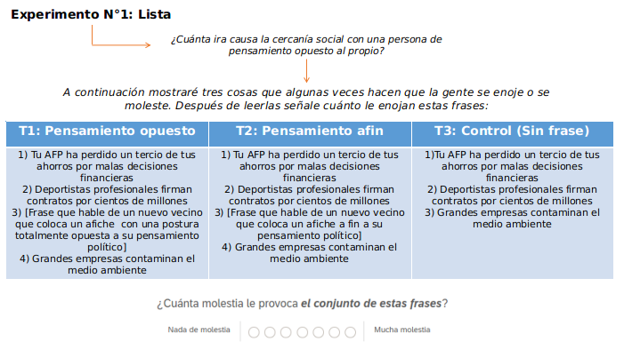
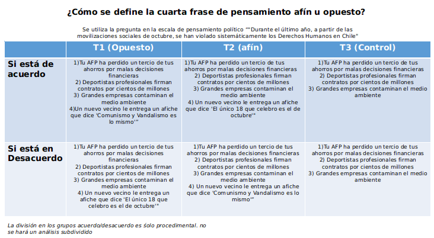
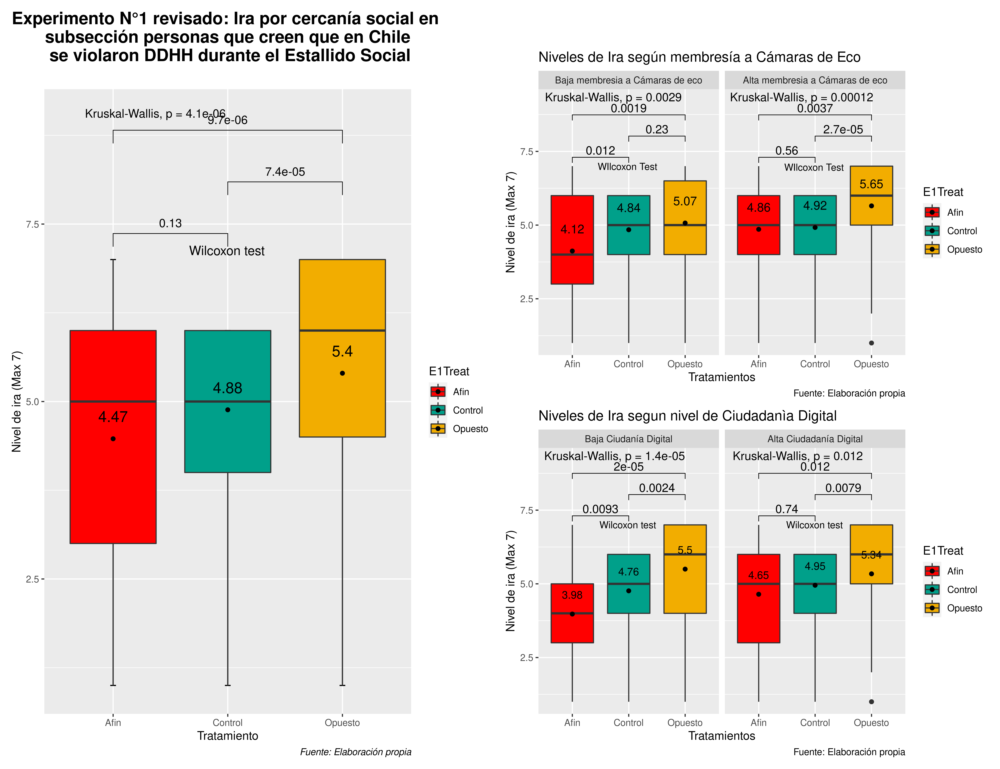
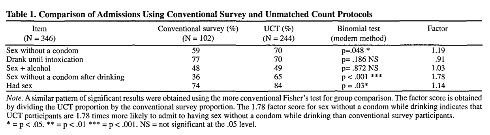
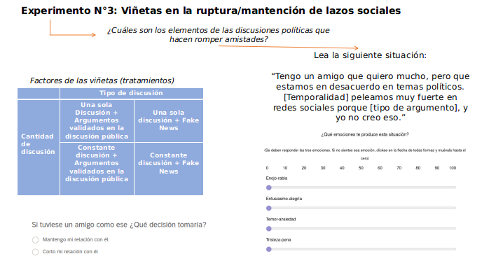
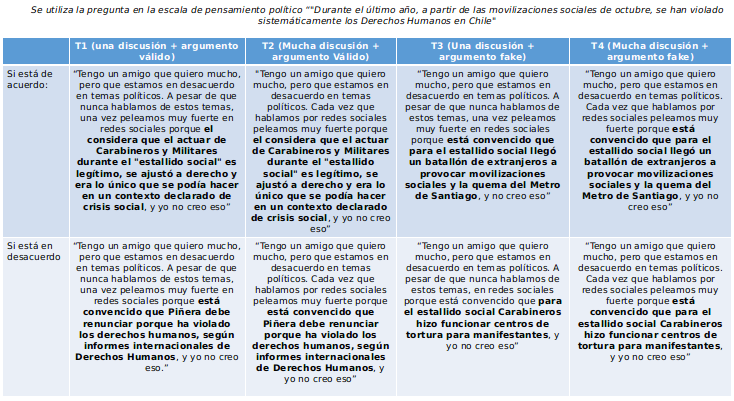
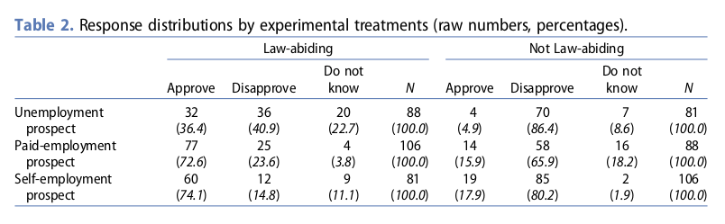
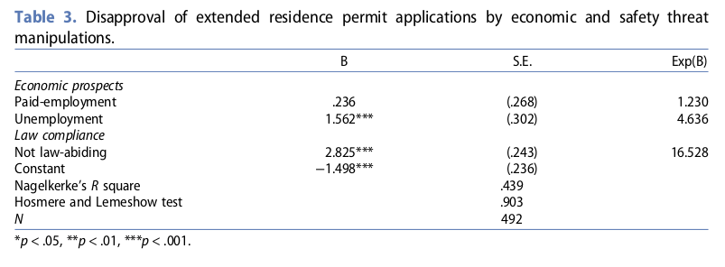

class:center, middle, bg_karl

```{r setup, include=FALSE}
options(htmltools.dir.version = FALSE)
knitr::opts_chunk$set(
  fig.width=9, fig.height=3.5, fig.retina=3,
  out.width = "100%",
  cache = FALSE,
  echo = TRUE,
  message = FALSE, 
  warning = FALSE,
  hiline = TRUE
)
```


```{r xaringan-themer, include=FALSE, warning=FALSE}
library(knitr)
library(xaringanthemer)
style_duo_accent(
  primary_color = "#b01333",
  secondary_color = "#085e9f",
  inverse_header_color = "#FFFFFF"
)
```
```{css, echo=F}
h1, h2, h3 {
  text-align: center;
}
```


```{css, echo = F}

.reduced_opacity {
  opacity: 0.1;
}


.bg_karl {
  position: relative;
  z-index: 1;
}
.bg_karl::before {    
      content: "";
      background-image: url('https://www.washingtonpost.com/wp-apps/imrs.php?src=https://arc-anglerfish-washpost-prod-washpost.s3.amazonaws.com/public/R6XIM6HGFZDSJJT5GHTYLYHIFI.jpg&w=1450');
      background-size: cover;
      position: absolute;
      top: 0px;
      right: 0px;
      bottom: 0px;
      left: 0px;
      opacity: 0.35;
      z-index: -1;
}
```

## Técnicas aplicadas en encuestas experimentales

### Experimentos de Lista y Experimento de viñetas

<br>

#### Francisco Villarroel Riquelme (CICS- UDD) 
#### 


<br>
<br>
<br>
<br>
<br>
```{r, echo=FALSE, message = FALSE, out.width="40%", fig.align='center', fig}
knitr::include_graphics("session_2_files/logo_mepop.png")
```

---
background-image: url(session_2_files/logo_mepop.png)
background-size: 200px
background-position: 97% 97%

# ¿Qué veremos hoy?

<br>
<br>
<br>

- Conocer las definiciones y utilidades de los experimentos de lista y viñeta
- Comprender cómo diseñas experimentos de lista y viñeta adecuados para distintos temas de CCSS Experimentales
- Analizar distintos ejemplos de experimentos de Lista y Viñetas

---
background-image: url(session_2_files/logo_mepop.png)
background-size: 200px
background-position: 97% 97%
class: center, middle

## Antes decualquier cosa, haremos una [Encuesta](https://unisdc.qualtrics.com/jfe/form/SV_elI2N2plXCtxySO)

---
background-image: url(session_2_files/logo_mepop.png)
background-size: 200px
background-position: 97% 97%
class: left, middle

## Encuestas experimentales

#### Características

- Son encuestas que dentro de sí incluyen preguntas diferenciadas (a modo de tratamiento) y aleatorizadas
- Tienden a hacerse con n más altos que los de laboratorio (400 - 1600)
- Habitualmente cortas y sencillas de analizar
- Variedad de formatos (experimentos de viñetas, de lista, Choice Experiments, Conjoint Expeirments, etc)

#### Desafíos

- Es fácil tender a medir actitudes por sobre comportamiento
- Para lograr esto último requiere de buenas habilidades de programación y creatividad


---
background-image: url(session_2_files/logo_mepop.png)
background-size: 200px
background-position: 97% 97%
class: center, middle

## ¿Cómo preguntar en una encuesta cuestiones socialmente complejas?

--

**Las encuestas observacionales preguntan de manera directa cuestiones que las personas tienden a ocultar**

--

**El "Sesgo de desabilidad social" es el sesgo producido cuando de contesta creyendo en qué es lo más socialmente aceptable, y no lo que yo realmente pienso**

---
background-image: url(session_2_files/logo_mepop.png)
background-size: 200px
background-position: 97% 97%

.pull-left[


<br>
<br>
<br>
<br>
<br>
<br>
<br>
<br>

### Preguntas típicas con sesgo de deseabilidad social


].pull-right[

1. [CEP 2019] "Me gustaría preguntarle sobre acciones que la gente hace para
protestar contra algo que le parece injusto. ¿Con qué frecuencia usted justificaría o no justificaría las
siguientes acciones.
- Participar en Marchas como forma de protesta.
- Evadir el pago de transporte público.
- Participar en barricadas o destrozos como fora de protesta.
- Provocar incendios en edificios y locales comerciales como forma de protesta.
- Participar en saqueos como forma de protesta.

2. [ENS 2016] ¿Ha usado preservativo o condón en los últimos 12 meses?

3. [ENS 2016] Preguntar sobre métodos de intento de suicidio
4. ¿Ud. Ha robado artículos en la empresa?


]

---
class: inverse center middle

# Experimentos de viñeta

---
background-image: url(session_2_files/logo_mepop.png)
background-size: 200px
background-position: 97% 97%
class: left, middle

## ¿Qué es un experimento de lista?

.pull-left[

- Un experimento de lista es una técnica no-obstructiva (indirecta) que consiste en la construcción de, al menos, dos set de afirmaciones.
- La variable dependiente es habitualmente una escala de polaridad que pueden ser emociones, actitudes de aversión, o una simple escala likert. 

>_"temas sensibles insertados en una lista con numerosos ítemes no-sensibles, y los participantes se les pregunta cuántos de esos ítemes están de acuerdo o les ha ocurrido, pero no cuáles. Este enfoque reduce los costos/riesgos percibidos de responder honestamente"_ (Kramon & Weghorst, 2019)

]

.pull-right[

#### Principales ventajas

- Da números mucho más realistas de preguntas donde la gente miente
- No se les miente a las personas. Es éticamente impecable
- Llega donde ningun otro tipo de preguntas experimentales puede llegar
- Usa menos recuersos que otros experimentos (ej: laboratorio)


#### Desventajas

- Sólo entrega datos agregados/grupales
- Entrega "poca" información
- Requiere mucho trabajo en el proceso de construcción de listas (validación obligada)


]

---
background-image: url(session_2_files/logo_mepop.png)
background-size: 200px
background-position: 97% 97%
class: left, top

## Ejemplo:

```{r, echo=FALSE, out.width="80%", fig.align='center'}



```

---
background-image: url(session_2_files/logo_mepop.png)
background-size: 200px
background-position: 97% 97%
class: left, top

### ¿Cómo se definen?


```{r, echo=FALSE, out.width="80%", fig.align='center'}



```


---
background-image: url(session_2_files/logo_mepop.png)
background-size: 200px
background-position: 97% 97%
class: left, top


### Ejemplo de resultados

```{r, echo=FALSE, out.width="67%", fig.align='center'}



```

---
background-image: url(session_1_files/logo_mepop.png)
background-size: 200px
background-position: 97% 97%
class: left, middle


### _Item Count Technique_ (ICT) o _Unmatched Count Technique_ (UCT)

>"El protocopo para el UCT es asignar individuos aleatoriamente dentro de dos grupos. Uno de estos grupos recibe una serie (nos apoyaremos en 5) de 5 declaraciones no-sensibles. A las personas se les pide que nos digan cuántas de esas frases los identifican" (Dalton et.al, 1994)

>El segundo grupo recibe seis declaraciones, cinco de las cuales son inocuas y la sexta es la sensible. 


---
class: center top

### Ejemplo (Dalton et.al, 1994)

Control                                               | Tratamiento
------------------------------------------------------|----------------------------------------------------------------------------------------
Usualmente tomo suplementos vitamínicos todos los días| Usualmente tomo suplementos vitamínicos todos los días
He leído "El príncipe"                                | He leído "El príncipe"   
Hay un arma en la casa donde vivo                     | Estoy involucrado en el robo de dinero o insumos a mi empleador por más de 5 mil pesos
He vivido en dos o más estados                        | Hay un arma en la casa donde vivo   
He vivido en otros países diferentes de EEUU          | He vivido en dos o más estados   
                                                      | He vivido en otros países diferentes de EEUU 
                                                      
<br>


**¿Cuántas de estas declaraciones le identifican?**

---
background-image: url(session_2_files/logo_mepop.png)
background-size: 200px
background-position: 97% 97%
class: left, top

## Forma de análisis

$$ \hat{p} = media_t - media_c$$
Donde:

1. $\hat{p}$ = Proporción de sujetos involucrados en el comportamiento sensible.
2. $mean_c$ = Media del número de declaraciones con las cuales la gente se identifica, sin la declaración sensible
3. $mean_t$ = Media del número de delaraciones con las cuales la gente se identifica

Entonce, como ejemplo: 

$$\hat{p} = 2.31 - 2.1$$
$$\hat{p} = 0.21$$

Podemos concluir que un 21% de la población de ambos grupos ha robado insumos o dinero a su empleador, sin preguntar directamente.

---
background-image: url(session_2_files/logo_mepop.png)
background-size: 200px
background-position: 97% 97%
class: left, top

### ¿Qué tanto cambian los resultados?

```{r, echo=FALSE, out.width="90%", fig.align='center'}



```
 
 <br>
 <br>
 
 <font size="-1">Basado en LaBrie, J& Earleywine, M (2014). <em>Sexual risk behaviors and alcohol: Higher base rates revealed using the unmatched-count Technique</em>. The Journal of Sex research. 321-326.  </font>


---
class: inverse center middle

# Experimentos de viñeta


---
background-image: url(session_2_files/logo_mepop.png)
background-size: 200px
background-position: 97% 97%

## Definición

--

#### ¿Qué es una viñeta?

>_"Una viñeta es una descripción de una persona objeto o situación cuidadosamente construida, representando una combinación sistemática de características"_(Atmüller y Steiner,2010)

- **Objetivo**: "El diseño especial de viñeta permite la presentación simultánea de diversas explcaciones así como factores contextuales los cualeentrega escenarios más realistas presentados a los respodientes"

--

**¿Qué cosas pueden ser viñetas?**

1. Textos
2. imágenes
3. Videos
4. Cualquier cosa que se pueda modificar y controlar para ver efectos causales

---
background-image: url(session_2_files/logo_mepop.png)
background-size: 200px
background-position: 97% 97%

## Modelos de diseño y pasos a seguir

--

.pull-left[

#### Diseños Factoriales cofundados

- Todas las viñetas se utilizan, y todos reciben la misma cantidad de viñetas
- No es recomendable mostrar muchas viñetas seguidas. ¡la gente se cansa y aburre!
- De esta manera la estructura de aleatorización y factores puede ser planeada
- Diseños 2x1, 2x2, 3x2, 3x3,... nxn

]


.pull-right[

#### Pasos a seguir:

1. Definir cuántos factores pretendo aleatorizar
2. Definir las "escalas" o cantidad de variaciones que tendrá cada factor
3. Construir una viñeta como línea de base
4. Agregar a la línea de base los factores que quiero modificar y testear
5. Probar, probar, probar y seguir probándolos. La validación no es opcional: es obligación


]

---
background-image: url(session_2_files/logo_mepop.png)
background-size: 200px
background-position: 1% 98%
class: left, middle

##Balance

#### Ventajas

- Se pueden dar conclusiones de tipo causal a partir de la combinatoria de factores
- Se pueden combinar una cantidad gigante de factores (hasta 96 condiciones experimentales!)
- Es menos obstructiva que otras formas de experimentos
- Se usa mucho para analizar cuestiones como racismo, pobreza, discriminación, criminalidad, etc

--

#### Desventajas

- Está principalmente a nivel de medición de actitudes
- No está completamente libre de sesgo de deseabilidas social
- Difícil de hacer viñetas de buena calidad cuando no es texto (sobretodo videos)
-

---
background-image: url(session_2_files/logo_mepop.pngg)
background-size: 200px
background-position: 1% 98%
class: left, middle

## Ejemplo 1


```{r, echo=FALSE, out.width="80%", fig.align='center'}




```

---
background-image: url(session_2_files/logo_mepop.png)
background-size: 200px
background-position: 1% 98%
class: left, middle

## Ejemplo 1 - Diseños factoriales


```{r, echo=FALSE, out.width="80%", fig.align='center'}


```
---
background-image: url(session_2_files/logo_mepop.png)
background-size: 200px
background-position: 1% 98%
class: left, middle

### Ejemplo 2 - Comportamiento frente a migrantes

**Tema**: Actualmente la Política migratoria es uno de los temás más relevantes en Europa. Como distintos partidos de derecha crecen a partir de actitudes anti-migración, se vuelte tema crucial para entender la Política Europea contemporánea

**Propuesta**: Estudio 1: Se analiza el nivel de apoyo a inmigrantes cuando interactúan dos factores: Económicos y criminalidad

**Diseño**: 3 Tratamientos con viñetas: Texto para aprobar la renovación de inmigrantes. Las viñetas mezclan atributos económicos y nivel de respeto a la ley.  Los participantes deben aprovar o rechazar la petición del inmigrante.

**Diseño**: 3x2 (Cesante/Trabajador a contrata/ Autoempleado) x (Respetuoso de la ley / Infractor de ley)

**Medición**: Tablas de contingencia y regresiones logísticas

 <font size="-1">Basado en Turper, Seded (2017). “Fearing what? Vignette experiments on anti-immigrant sentiments”. Journal of Ethnic and Migration Studies.43(11). Pp. 1792 - 1812. 2017. DOI: 10.1080/1369183X.2016.1263554. </font>

---
background-image: url(session_2_files/logo_mepop.png)
background-size: 200px
background-position: 1% 98%
class: left, middle
```{r, echo=FALSE, out.width="80%", fig.align='center'}



```

Los infractores de ley tienen más altas tazas de rechazo y desempleados en segundo lugar. Ambas variables se vuelven relevantes

---
background-image: url(session_2_files/logo_mepop.png)
background-size: 200px
background-position: 1% 98%
class: left, middle
```{r, echo=FALSE, out.width="80%", fig.align='center'}



```

nmigrantes potencialmente receptores de beneficios tienen casi 4 veces y media posibilidades de ser rechazados en comparación a los emprendedores. 

El no cumplimiento de la ley es un preditor mucho más poderoso de rechazo que los costos económicos. Hasta 16 veces más probable su rechazo.


---
background-image: url(session_2_files/logo_mepop.png)
background-size: 200px
background-position: 97% 97%
class: left, top

## Bibliografía sugerida para comenzar a aprender:

- Coleman, Renita (2018). _Designing Experiments for the Social Sciences: How to Plan, Create, and Execute Research Using Experiments_. SAGE.

- Mutz, Diana (2011). _Population-based survey experiments_. Princeton University Press. 

- Atzmüller, C & Steiner, P (2010). _Experimental Vignette Studies in Survey Research_. Methodoloogy. Vol 6, N°3. 128 - 138. 

- Dalton et.al (1994). _Using the unmatched count technique (UCT) to estimate base rates for sensitive behavior_. Personnel Psychology. Vol.47, N°4. 817 - 829.

- Labrie, J. & Earlywine, M. (2014). _The Item Count Technique as a Method of Indirect Questioning: A Review of Its Development and a Case Study Application_. In Biemer et.al. Wiley Series un probability and Statistics. 185 - 210.

- Kuklinski, J. et. al. (1997). _Racial Attitudes and the "New South"_. The journal of politics. Vol. 59, N°2. 323 - 349.

---
class: inversed, center, middle
background-image: url(https://user-images.githubusercontent.com/163582/45438104-ea200600-b67b-11e8-80fa-d9f2a99a03b0.png)
background-size: 80px
background-position: 50% 90%

# ¡Gracias!


###fvillarroelr@udd.cl

Slide creado con el paquete [**xaringan**](https://github.com/yihui/xaringan).


El  chakra viene de [remark.js](https://remarkjs.com), [**knitr**](https://yihui.org/knitr/), y [R Markdown](https://rmarkdown.rstudio.com).
Este slide fue creado por [**xaringan**](https://github.com/yihui/xaringan) y [**XaringanThemer**](https://pkg.garrickadenbuie.com/xaringanthemer/index.html)